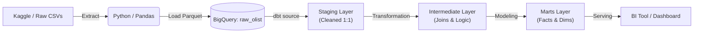

# Olist E-commerce analysis


## 🎯 Project Overview

This project implements a robust **ELT (Extract, Load, Transform)** pipeline designed to process the [Brazilian E-Commerce Public Dataset](https://www.kaggle.com/datasets/olistbr/brazilian-ecommerce?select=olist_orders_dataset.csv) by Olist.

The pipeline extracts data from Kaggle, loads it directly into BigQuery (Raw Layer) using Python, and performs dimensional modeling using **dbt** to create analytics-ready tables.

## 🏗️ Architecture

The solution follows a modern ELT pattern:

1.  **Extract:** Python scripts fetch raw CSV data from Kaggle/Local Source.
2.  **Load:** Data is processed in-memory (Pandas) and loaded directly into **Google BigQuery** using the `google-cloud-bigquery` client (Parquet serialization for robustness).
3.  **Transform:** **dbt (data build tool)** orchestrates the transformation logic through three distinct layers:
    - **Staging (Silver):** 1:1 cleaning, type casting, and standardizing naming conventions.
    - **Intermediate:** Complex joins, aggregations, and business logic isolation.
    - **Marts (Gold):** Final, consumer-ready Fact and Dimension tables (Star Schema).



## 🛠️ Tech Stack

- **Language:** Python 3.11+

- **Dependency Manager:** `uv` (Rust-based, ultra-fast replacement for pip/poetry)

- **Data Warehouse:** Google BigQuery (Sandbox/Free Tier compatible)

- **Transformation:** dbt Core (adapter: `dbt-bigquery`)

- **Orchestration:** Custom Python Pipeline (`main.py`)

- **Infrastructure:** GCP Service Account (IAM)

## 🚀 Getting Started

### Prerequisites

- Python 3.11+ installed.

- uv installed (`curl -LsSf https://astral.sh/uv/install.sh | sh`).

- Google Cloud Platform (GCP) Account with a project created.

### GCP Setup

To run this project, you need a Service Account with BigQuery Admin permissions:

1. Go to GCP Console > IAM & Admin > Service Accounts.

2. Create a new account (e.g., `etl-owner`).

3. Assign the role: BigQuery Admin.

4. Create a JSON Key for this account and download it.

5. Rename the file to `service_account.json` and place it in the root of this project.

    > [!IMPORTANT] The service_account.json file contains sensitive credentials and is ignored by git for security.

### Installation

Clone the repository and sync dependencies using `uv`:

```bash
git clone git@github.com:guifaraco/data-project-ecommerce.git olist-data-platform
cd olist-data-platform

# Install dependencies from pyproject.toml and create virtualenv
uv sync
```

> [!NOTE] Activate the python virtual environment if not activated after sync

### Configure dbt Profile

Create a `profiles.yml` file in your `~/.dbt/` directory (if it doesn't already exist). Configure it with your GCP project details:

```yml
olist_data_platform:
    target: dev
    outputs:
        dev:
            type: bigquery
            method: service-account
            project: <YOUR_GCP_PROJECT_ID>
            dataset: <YOUR_DBT_DATASET_NAME> # e.g., dbt_guilherme
            threads: 4
            keyfile: /absolute/path/to/your/project/service_account.json
            location: US
```

### Configure Kaggle Credentials

1. Log in to your Kaggle account and go to Settings > API > Create New Token.

2. Copy the key/token.

3. Create a .env file in the project root and add your token:

```
KAGGLE_API_TOKEN=your_token_here
```

### Running the Pipeline

**Phase 1: Ingestion (EL)** Run the main Python script to create the dataset in BigQuery and load the raw tables.

```bash
uv run python -m src.main
```

Expected Output: Logs indicating successfull load of tables like `orders`, `items`, `reviews` into `raw_olist` dataset.

**Phase 2: Transformation (T)** Run dbt to build the staging and marts models.

```bash
# Debug connection first (Ensure profiles.yml is set correctly)
dbt debug --project-dir ./your_dbt_project_dir_here

# Run the models
dbt run --project-dir ./your_dbt_project_dir_here

# Run tests
dbt test --project-dir ./your_dbt_project_dir_here
```

## 👤 Author

**Guilherme Faraco** _Data Engineer | Analytics Engineer_

[](www.linkedin.com/in/guilherme-faraco-86597022b)
[](https://github.com/guifaraco)

## 📄 License

This project is licensed under the MIT License - see the [LICENSE](LICENSE) file for details.
